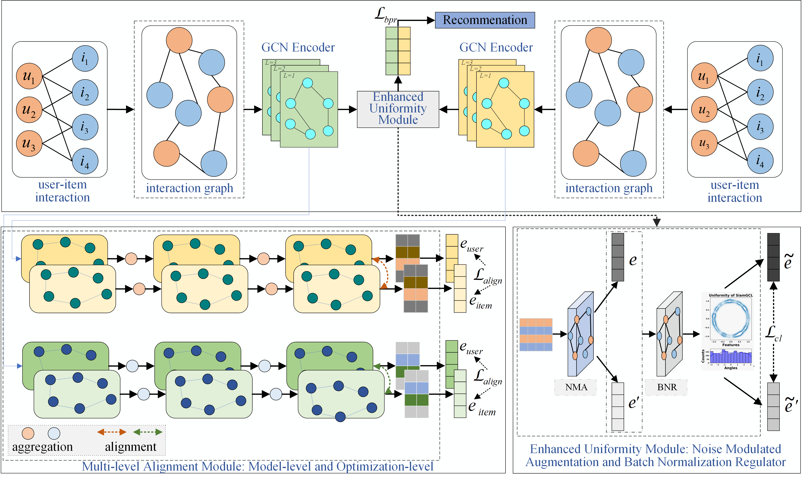

<p align="left">
  
</p>

# **Datasets**
Datasets at this link: <https://drive.google.com/drive/folders/1QkJzLU3z0kV72yjx2FjN50krrsyTYIJZ?hl=zh-CN>
# **Environment**
To set up the environment, follow the instructions below:
```python
python 3.8.0
pyTorch 1.13.0
numba 0.58.1
scipy 1.10.1
faiss 1.7.3
tdqm 4.65.0
```
# **Basic Comparisons**
Taking the Alibaba-iFashion datasets as an example.

| Model     | Recall@10 | Recall@20 | Recall@50 | NDCG@10 | NDCG@20 | NDCG@50 |
|-----------|-----------|-----------|-----------|---------|---------|---------|
| BPR-MF    | 0.0363    | 0.0550    | 0.0920    | 0.0199  | 0.0247  | 0.0323  |
| NCF       | 0.0246    | 0.0394    | 0.0710    | 0.0131  | 0.0170  | 0.0234  |
| NGCF      | 0.0381    | 0.0610    | 0.1080    | 0.0200  | 0.0259  | 0.0355  |
| LightGCN  | 0.0582    | 0.0876    | 0.1433    | 0.0321  | 0.0398  | 0.0511  |
| SGL       | 0.0745    | 0.1098    | 0.1734    | 0.0419  | 0.0511  | 0.0641  |
| NCL       | 0.0761    | 0.1109    | 0.1758    | 0.0423  | 0.0520  | 0.0645  |
| SimpleX   | 0.0806    | 0.1174    | 0.1812    | 0.0456  | 0.0552  | 0.0683  |
| XSimGCL   | 0.0804    | 0.1178    | 0.1853    | 0.0455  | 0.0551  | 0.0690  |
| AdaGCL    | 0.0771    | 0.1135    | 0.1789    | 0.0434  | 0.0529  | 0.0662  |
| DirectAU  | 0.0799    | 0.1179    | 0.1868    | 0.0450  | 0.0549  | 0.0688  |
| SiamGCL   | 0.0836    | 0.1244    | 0.1950    | 0.0460  | 0.0566  | 0.0711  |


# **Acknowledgement**
SiamGCL is based on the following open-source frameworks and would like to express our sincere gratitude for their contributions:

SELFRec: <https://github.com/Coder-Yu/SELFRec>

ID-GRec: <https://github.com/BlueGhostYi/ID-GRec>
